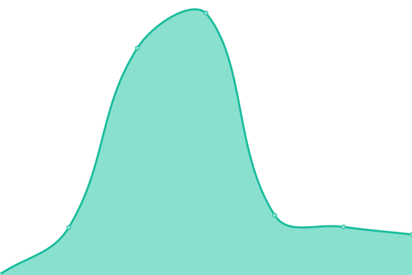
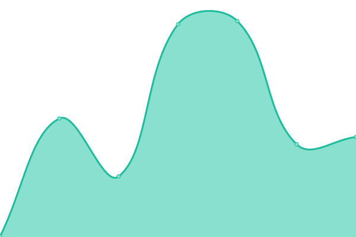
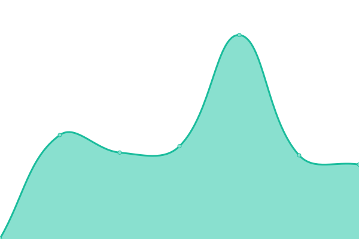
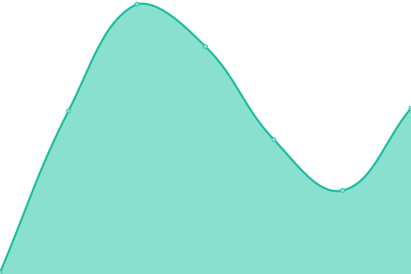
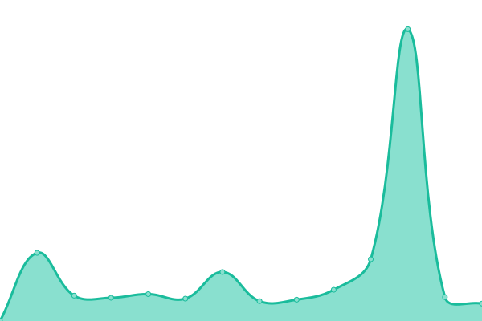

# [📈 Live Status](https://demo.upptime.js.org): <!--live status--> **🟧 Partial outage**

This repository contains the open-source uptime monitor and status page for [pohsunwang](https://demo.upptime.js.org), powered by [Upptime](https://github.com/upptime/upptime).

With [Upptime](https://upptime.js.org), you can get your own unlimited and free uptime monitor and status page, powered entirely by a GitHub repository. We use [Issues](https://github.com/boshwang3699/BDC-final/issues) as incident reports, [Actions](https://github.com/boshwang3699/BDC-final/actions) as uptime monitors, and [Pages](https://demo.upptime.js.org) for the status page.

<!--start: status pages-->
<!-- This summary is generated by Upptime (https://github.com/upptime/upptime) -->
<!-- Do not edit this manually, your changes will be overwritten -->
<!-- prettier-ignore -->
| URL | Status | History | Response Time | Uptime |
| --- | ------ | ------- | ------------- | ------ |
|  [Google](https://www.google.com) | 🟩 Up | [google.yml](https://github.com/boshwang3699/BDC-final/commits/HEAD/history/google.yml) | 

 72ms
     
 | 

<a href="https://demo.upptime.js.org/history/google">100.00%</a>
    

|  [Wikipedia](https://en.wikipedia.org) | 🟩 Up | [wikipedia.yml](https://github.com/boshwang3699/BDC-final/commits/HEAD/history/wikipedia.yml) | 

 238ms
     
 | 

<a href="https://demo.upptime.js.org/history/wikipedia">100.00%</a>
    

|  [Hacker News](https://news.ycombinator.com) | 🟩 Up | [hacker-news.yml](https://github.com/boshwang3699/BDC-final/commits/HEAD/history/hacker-news.yml) | 

 403ms
     
 | 

<a href="https://demo.upptime.js.org/history/hacker-news">100.00%</a>
    

|  [Test Broken Site](https://thissitedoesnotexist.koj.co) | 🟥 Down | [test-broken-site.yml](https://github.com/boshwang3699/BDC-final/commits/HEAD/history/test-broken-site.yml) | 

 0ms
     
 | 

<a href="https://demo.upptime.js.org/history/test-broken-site">100.00%</a>
    

|  [Twitch](https://www.twitch.tv) | 🟩 Up | [twitch.yml](https://github.com/boshwang3699/BDC-final/commits/HEAD/history/twitch.yml) | 

 96ms
     
 | 

<a href="https://demo.upptime.js.org/history/twitch">100.00%</a>
    

|  [Youtube](https://www.youtube.com) | 🟩 Up | [youtube.yml](https://github.com/boshwang3699/BDC-final/commits/HEAD/history/youtube.yml) | 

 266ms
     
 | 

<a href="https://demo.upptime.js.org/history/youtube">100.00%</a>
    

|  [Facebook](https://www.facebook.com) | 🟩 Up | [facebook.yml](https://github.com/boshwang3699/BDC-final/commits/HEAD/history/facebook.yml) | 

 575ms
     
 | 

<a href="https://demo.upptime.js.org/history/facebook">100.00%</a>
    

|  [LeetCode](https://leetcode.com) | 🟩 Up | [leet-code.yml](https://github.com/boshwang3699/BDC-final/commits/HEAD/history/leet-code.yml) | 

 232ms
     
 | 

<a href="https://demo.upptime.js.org/history/leet-code">100.00%</a>
    

|  [W3schools](https://www.w3schools.com) | 🟩 Up | [w3schools.yml](https://github.com/boshwang3699/BDC-final/commits/HEAD/history/w3schools.yml) | 

 123ms
     
 | 

<a href="https://demo.upptime.js.org/history/w3schools">100.00%</a>
    

|  [NCU CHST](https://chst.ncu.edu.tw) | 🟩 Up | [ncu-chst.yml](https://github.com/boshwang3699/BDC-final/commits/HEAD/history/ncu-chst.yml) | 

 2085ms
     
 | 

<a href="https://demo.upptime.js.org/history/ncu-chst">100.00%</a>
    

|  [Discord Bot](https://discord-coinbot.boshwang.repl.co) | 🟩 Up | [discord-bot.yml](https://github.com/boshwang3699/BDC-final/commits/HEAD/history/discord-bot.yml) | 

 1655ms
     
 | 

<a href="https://demo.upptime.js.org/history/discord-bot">33.79%</a>
    

|  [Invalid site](https://www.invalidsite.com) | 🟥 Down | [invalid-site.yml](https://github.com/boshwang3699/BDC-final/commits/HEAD/history/invalid-site.yml) | 

 0ms
     
 | 

<a href="https://demo.upptime.js.org/history/invalid-site">100.00%</a>
    

<!--end: status pages-->

[**Visit our status website →**](https://demo.upptime.js.org)

## 📄 License

- Powered by: [Upptime](https://github.com/upptime/upptime)
- Code: [MIT](./LICENSE) © [pohsunwang](https://demo.upptime.js.org)
- Data in the `./history` directory: [Open Database License](https://opendatacommons.org/licenses/odbl/1-0/)
